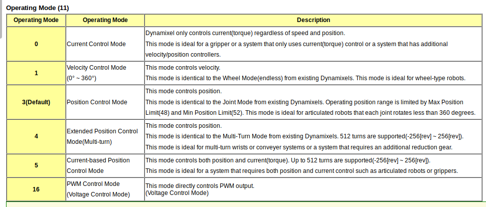

# DYNAMIXEL INTERFACE FOR ROS CONTROL OF THE DB-ALPHA ROBOT

## Installation guide:

This controller uses the latest version of the Dynamixel Workbench driver (May 2019)

Install Main packages:

```sh
$ cd catkin_ws/src
$ git clone https://github.com/CVH95/db_alpha_interface.git
$ git clone https://github.com/ROBOTIS-GIT/dynamixel-workbench.git
$ git clone https://github.com/ROBOTIS-GIT/dynamixel-workbench-msgs.git
``` 

Install dependent packages:

```sh
$ git clone https://github.com/ROBOTIS-GIT/DynamixelSDK.git
$ git clone https://github.com/ROBOTIS-GIT/open_manipulator_msgs.git
$ sudo apt-get install ros-kinetic-moveit-core ros-kinetic-moveit-ros-planning ros-kinetic-moveit-ros-planning-interface
```

Compile and build the pkgs:

```sh
$ cd ../
$ catkin_make
```

#### Official documentation:

 - **Install:** Go to [Official Dynamixel Workbench Manual](http://emanual.robotis.com/docs/en/software/dynamixel/dynamixel_workbench/).


 - **Online Motor Control Table:** Go to [ROBOTIS e-manual Dynamixel XM430-W350](http://emanual.robotis.com/docs/en/dxl/x/xm430-w350/#indirect-data).

 - **Online Motor Datasheet:** Go to [ROBOTIS XM430-W350 support](http://support.robotis.com/en/product/actuator/dynamixel_x/xm_series/xm430-w350.htm).

## Configuration

 Before starting the driver, you need to configure the setup, including motor IDs, operating mode and return delay time. It is also possible to set up gains and acceleration and velocity profiles from the YAM file profile. See examples of configuration files in _/db\_alpha\_controllers/config/_. 

 ```yaml
# Example of YAML configuration file

id_1:
  ID: 11
  Return_Delay_Time: 0
  Operating_Mode: 3
  Position_P_Gain: 400
  Position_I_Gain: 200
  Position_D_Gain: 50
  Profile_Velocity: 200
  Profile_Acceleration: 50
```

 #### Operating modes

 - Caption from the XM430-W350 datasheet:



## Torque control: torque-current linear relationship:

```c
// Current unit A || Torque unit N*m
float m = 0.5828571429;
float n = 0.072;
float current_A = torque_Nm*m + n;

// Dynamixel current unit mA (This is the value to send to the ROS driver)
float dxl_current = current_A*1000;

// Dynamixel converts current values in mA to motor values with the following relationship:
float CURRENT_UNIT = 2.69;
int16_t value = dxl_current / CURRENT_UNIT;
```

## Running the Position Controller:

To start low level control of the open manipulator run the following command:

```sh
$ roslaunch db_alpha_controllers position_controller.launch
```

After launching the following node, issue basic position commands to the manipulator through the topic `/position_contoller/position_command` with the following format:

```sh
S rostopic pub /position_controller/position_command sensor_msgs/JointState 

"header:
  seq: 0
  stamp: {secs: 0, nsecs: 0}
  frame_id: ''
name: [id_1, id_2, id_3, id_4, id_5, id_6, id_7]
position: [0, 0, 0, 0, 0, 0, -1.57]
velocity: [0, 0, 0, 0, 0, 0, 0]
effort: [0, 0, 0, 0, 0, 0, 0]" 
```

Where id_1 is the first joint, sequentially to id_7 which is the gripper.

NOTE: There is a limited safe range of the gripper (id_7) which is between -1.00 and -3.14. Any values outside this range may cause damage to the gripper 


Before running any of the above code, the **USB latency between the computer and the robot** must be lowered. Run the following terminal commands to resolve this:


```sh
# Option A (recommended)
$ sudo usermod -aG dialout $USER && echo 1 | sudo tee /sys/bus/usb-serial/devices/ttyUSB0/latency_timer

# Option B
$ echo ACTION==\"add\", SUBSYSTEM==\"usb-serial\", DRIVER==\"ftdi_sio\", ATTR{latency_timer}=\"1\" > 99-dynamixelsdk-usb.rules
$ sudo cp ./99-dynamixelsdk-usb.rules /etc/udev/rules.d/
$ sudo udevadm control --reload-rules
$ sudo udevadm trigger --action=add
```

Then verify that the latency has been set to 1 with the following command:

```sh
$ cat /sys/bus/usb-serial/devices/ttyUSB0/latency_timer
```
